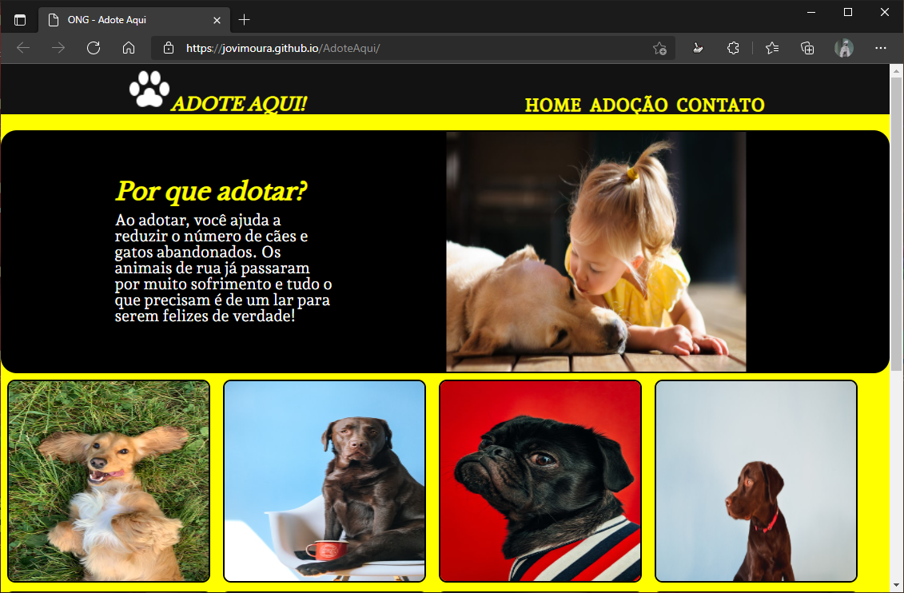

# Adote Aqui 🐶❤

Adote aqui é um site de adoção inventado por mim. Foi meu primeiro projeto e por isso ele não possui responsividade e etc. Futuramente pretendo refaze-lo pois foi meu primeiro projeto e foi nele que eu descobri que amava programar e a carreira de T.I era fascinante.

## Imagem do projeto 💻

## Como foi feito?🤔

O projeto foi feito com HTML e CSS para criar um design e um pouco de Java Script para alertar o usuário de que as funções de adoção dos pets não são reais pois o site de adoção não é real.

## Tecnologias utilizadas🦉

<ul>
    <li>HTML</li>
    <li>CSS</li>
    <li>Java Script</li>
</ul>

## Autor😊
## João Victor dos Santos Moura
## Github : jovimoura
## Email : joaovictors.mouraa@gmail.com